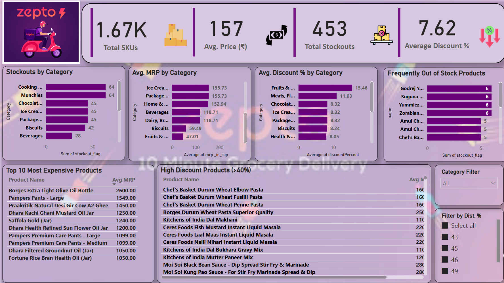

# 🛒 Zepto Inventory & Stockout Analysis

An end-to-end **Data Analysis** and **Power BI Dashboard** project based on Zepto’s product-level data.  
This project provides actionable insights into pricing, discount patterns, stockout frequency, and category-level trends, supporting informed inventory and operational decision-making.

---

## 📊 Project Goals

- Clean and prepare inventory data for analysis  
- Identify top-value products and high-discount items  
- Analyze frequent stockouts for supply chain planning  
- Build a clean, interactive Power BI dashboard for business reporting  

---

## 🧰 Tools Used

| Tool     | Purpose                              |
|----------|--------------------------------------|
| Excel    | Data cleaning and preparation        |
| Power BI | Dashboard creation and storytelling  |

---

## 📁 Project Structure

**Zepto-Inventory-Analysis/**  
├── **zepto_v1.xlsx** – Cleaned product-level data  
├── **zepto dashboard.pbix** – Final Power BI dashboard file  
├── **Dashboard_preview.png** – Dashboard layout preview  
└── **README.md** – Project overview and usage guide  

---

## 🔍 Key Insights

### ✅ Top 10 Expensive Products
- Identified using average MRP across SKUs

### ✅ High Discount Products
- Products with >40% discount — potential pricing issues or promotions

### ✅ Frequently Out-of-Stock Items
- Stockout flags summed to identify supply/demand mismatches

### ✅ Category-Level Trends
- **Average MRP**
- **Total Stockouts**
- **Average Discount %**

### ✅ Summary KPIs (via Cards)
- Total SKUs  
- Average MRP  
- Average Discount %  
- Total Stockouts  

---

## 📊 Dashboard Preview

---

## 🚀 How to Use This Project

1. Open `zepto dashboard.pbix` in Power BI Desktop  
2. Interact with slicers and visuals for different insights  
3. Use `zepto_v1.xlsx` if you want to reload/modify data  

---

## ✍️ Author

**Shivam Kasaudhan**  
Aspiring Data Analyst
[🔗 Connect on LinkedIn](https://www.linkedin.com/in/shivamkasaudhan1/)

---
